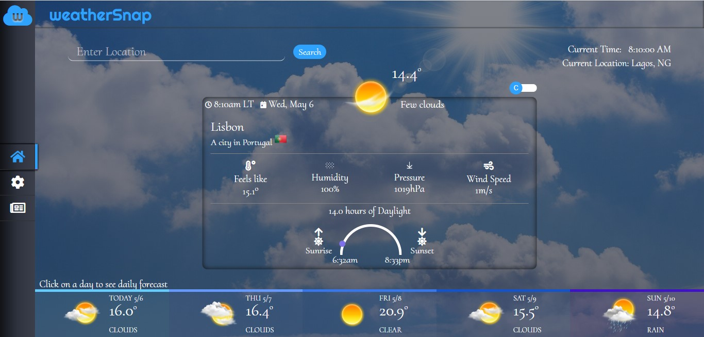

# WEATHERSNAP - WEATHER FORECAST APP

This project is a Weather App built with JavaScript. It implements the functionality of using a weather API (openweathermap.org), fetching data from its server and displaying them creatively on the project site. It also uses basically Factory functions and Module Patterns in creating the functionalities and logic.

## Table of Contents

* [About the Project](#about-the-project)
  * [Built With](#built-with)
* [Live Preview](#live-preview)
* [Required Installations](#required-installations)
* [Instalation of This App](#instalation)
* [License](#license)
* [Contact](#contact)
* [Acknowledgements](#acknowledgements)


<!-- ABOUT THE PROJECT -->
## About The Project

This project is a Weather web application. In this project, the following features were implemented;

- A page displays the data of the current location of the user with the use of ipfind API.
- A user can search for a specific location.
- A user is also presented with the functionality of choosing a location from a dropdown list of possible city search.
- A user can toggle the data to display in Fahrenheit or Celsius.
- The look of the page is changed based on the data from a searched location.
- A user can toggle tabs to see a 5-day forecast of the searched location. 
- The project also has the feature for users adding, saving and deleting three locations for live updates on the city's weather info.
- The project also has an additional feature where a user can also read up weather news highlights for the day.


The main goal is to build a full-fledged web app using a Weather API and also practice the use of Promise and Async/Await in making API calls.

Link for project specifications: [Odin-Project](https://www.theodinproject.com/courses/javascript/lessons/weather-app)

<!-- BUILT WITH -->
### Built With 

* HTML
* SCSS
* Git
* JavaScript
* Wepback
* [Netlify](https://www.netlify.com/) for deployment


<!-- LIVE PREVIEW -->
## Live Preview

This is the link to the live preview in Netlify. Feel free to visit.<br>
[WeatherSnap - Weather Forecast Web App](https://weather-snap.netlify.app)<br>
<p>Below are the HomePage Screenshots</p>

<br>
<br>


<!-- REQUIRED INSTALLATION -->
## Required Installations

<p>If you want a copy of this project running on your machine you have to install:</p>

* <a href="https://nodejs.org/en/">Node.js (v5. 2.0 or greater)</a>

<!-- INSTALLATION -->
## Installation of This App

Once you have installed the required package shown on the [Required Installations](#required-installations), proceed with the following steps

Clone the Repository,

```Shell
your@pc:~$ git clone https://github.com/adaorachi/js-weather-app
```

Move into the downloaded folder

```Shell
your@pc:~$ cd js-weather-app
```

Get the dependencies needed for the app

```Shell
your@pc:~$ npm install
```

Start the server and use the app

```Shell
your@pc:~$ npm run server
```

<!-- LICENSE -->
## License

Distributed under the MIT License. See `LICENSE` for more information.

<!-- CONTACT -->
## Author
* MaryAnn Chukwuka - annychuks07@gmail.com | [Github Account https://github.com/adaorachi](https://github.com/adaorachi)

<!-- ACKNOWLEDGEMENTS -->
## Acknowledgements
* [Microverse](https://www.microverse.org/)
* [OpenWeatherMap](https://openweathermap.org/) - Weather Forecast API
* [IPFind API](https://app.ipfind.org/) - IP/Location Finder API
* [IPFind API](https://newsapi.org/) - Weather News API
